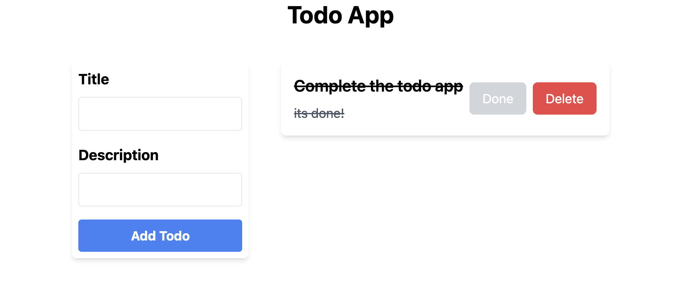

# Personal Todo List

This is a simple application for managing my personal to-do list.


## Installation

To install the application, clone the repository to your local machine and run the following command in your terminal:

```
yarn install
```




# Tech 


